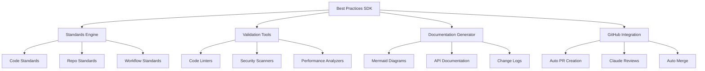
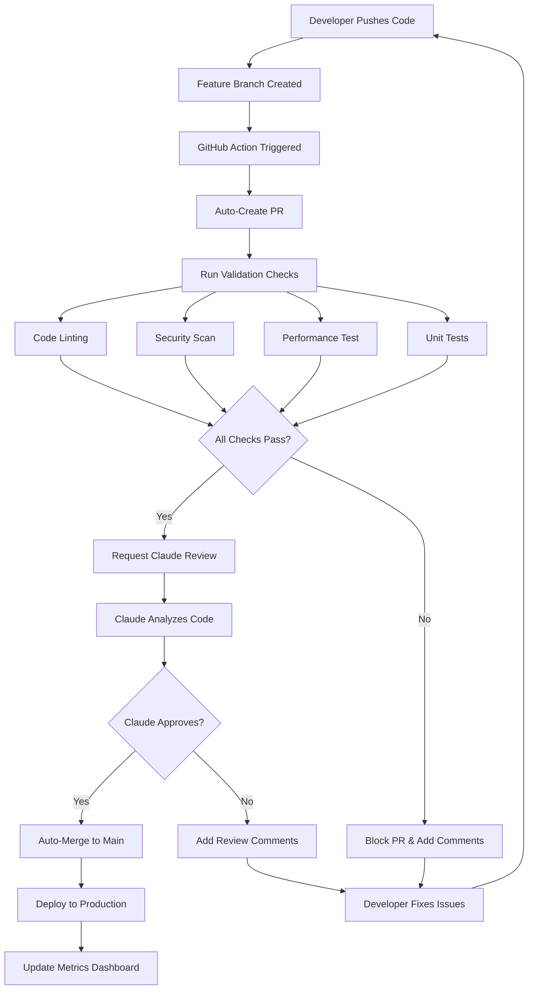
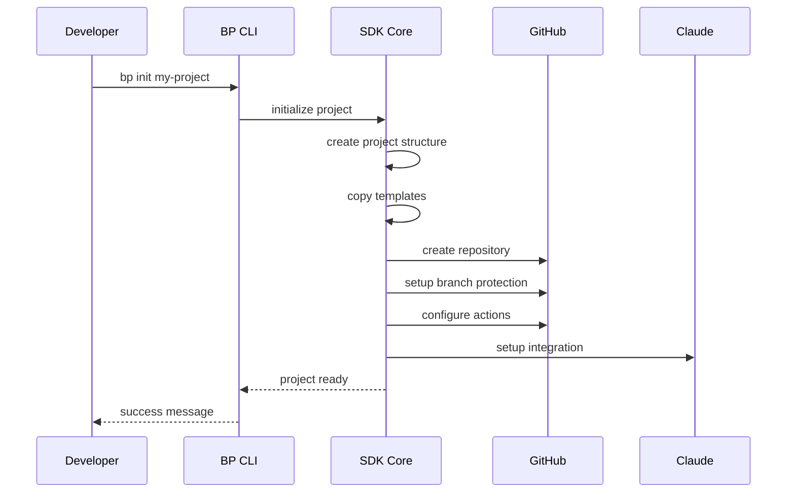
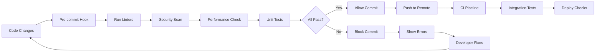
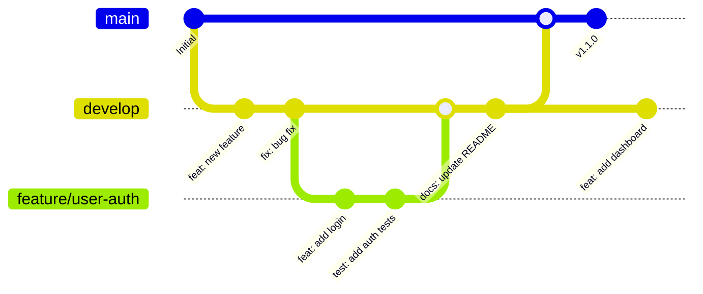

# Architecture Diagrams & Flows

## SDK Component Architecture

## Automated GitHub Workflow

## SDK Initialization Flow

## Validation Process Flow

## Release Management Flow

These diagrams serve as visual guides for understanding the SDK architecture, automated workflows, and integration points. They should be referenced during implementation to ensure all components work together seamlessly.